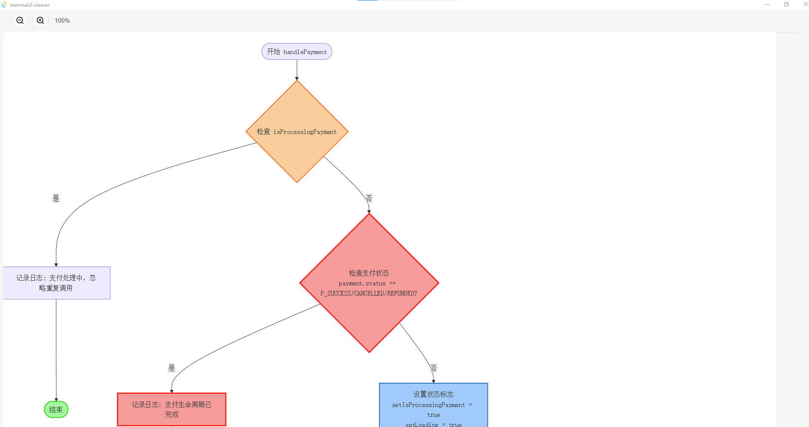

# Mermaid Viewer / Mermaid 图表浏览器

[English](#english) | [中文](#中文)

---

## 中文

### 简介

Mermaid Viewer 是一个极简轻量级的桌面应用程序，专为查看 Mermaid 图表而设计。我们专注于提供最简单、最直接的用户体验，没有任何多余的功能。

### 特点

- 🚀 **极轻量级**：启动速度快，资源占用少
- 📝 **功能简单**：只专注于查看 Mermaid 图表，没有复杂功能
- 🎨 **界面简洁**：干净直观的用户界面，没有多余元素
- 💾 **本地支持**：支持本地文件，无需网络连接
- 🔒 **隐私保护**：所有数据本地处理，不上传任何内容

### 截图



### 使用场景

- 快速查看 Mermaid 图表文件
- 简单的图表预览工具
- 不需要复杂编辑功能的用户

## English

### Introduction

Mermaid Viewer is an extremely lightweight desktop application designed specifically for viewing Mermaid diagrams. We focus on providing the simplest, most direct user experience without any unnecessary features.

### Features

- 🚀 **Extremely Lightweight**: Fast startup with minimal resource usage
- 📝 **Simple Functionality**: Focused only on viewing Mermaid diagrams, no complex features
- 🎨 **Clean Interface**: Minimal and intuitive UI without unnecessary elements
- 💾 **Local Support**: Supports local files, no internet connection required
- 🔒 **Privacy Protection**: All data processed locally, nothing uploaded

### Screenshot


### Use Cases

- Quick viewing of Mermaid diagram files
- Simple diagram preview tool
- Users who don't need complex editing features


   ```